## Event
### Start Event

####  None Start Event

####    Interrupting - Message Start Event

####    Non-interrupting - Message Start Event

####    Interrupting - Timer Start Event

####    Non-interrupting - Timer Start Event

####    Interrupting - Conditional Start Event

####    Non-interrupting - Conditional Start Event

####    Interrupting - Signal Start Event

####    Non-interrupting - Signal Start Event

####    Interrupting - Multiple Start Event

####    Non-interrupting - Multiple Start Event

####    Interrupting - Parallel Multiple Start Event

####    Non-interrupting - Parallel Multiple Start Event

####    Interrupting - Escalation Start Event

####    Non-interrupting - Escalation Start Event

####    Interrupting - Error Start Event

####    Interrupting - Compensation Start Event

### Intermediate Event

####  Interrupting - None Intermediate Event

####  Catch - Message Intermediate Event

####  Interrupting - Boundary - Catch - Message Intermediate Event

####  Non-interrupting - Boundary - Catch - Message Intermediate Event

####  Throw - Message Intermediate Event

####  Timer Intermediate Event

####  Interrupting - Boundary - Timer Intermediate Event

####  Non-interrupting Boundary - Timer Intermediate Event

####  Conditional Intermediate Event

####  Interrupting - Boundary - Conditional Intermediate Event

####  Non-interrupting - Boundary - Conditional Intermediate Event

####  Catch - Signal Intermediate Event

####  Interrupting - Boundary - Catch - Signal Intermediate Event

####  Non-interrupting - Boundary - Catch - Signal Intermediate Event

####  Interrupting - Boundary - Throw - Signal Intermediate Event

####  Catch - Multiple Intermediate Event

####  Interrupting - Boundary - Catch - Multiple Intermediate Event

####  Non-interrupting Boundary - Catch - Multiple Intermediate Event

####  Throw - Multiple Intermediate Event

####  Catch - Parallel Multiple Intermediate Event

####  Interrupting - Boundary - Catch - Parallel Multiple Intermediate Event

####  Non-interrupting Boundary - Catch - Parallel Multiple Intermediate Event

####  Catch - Escalation Intermediate Event

####  Interrupting - Boundary - Catch - Escalation Intermediate Event

####  Non-interrupting - Boundary - Catch - Escalation Intermediate Event

####  Throw - Escalation Intermediate Event

####  Boundary - Catch - Error Intermediate Event

####  Boundary - Catch - Compensation Intermediate Event

####  Throw - Compensation Intermediate Event

####  Catch - Link Intermediate Event

####  Throw - Link Intermediate Event

####  Boundary - Catch - Cancel Intermediate Event

### End Event

####  None End Event

####  Message End Event

####  Signal End Event

####  Multiple End Event

####  Escalation End Event

####  Error End Event

####  Compensation End Event

####  Cancel End Event

####  Terminate End Event

## Activity

 Task

 Sub Process

 Call Activity

### Tasks

####  Abstract Task

#### 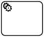 Service Task

####  Send Task

####  Receive Task

#### 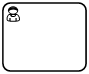 User Task

#### 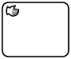 Manual Task

#### 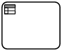 Business Rule Task

#### 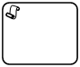 Script Task

### Sub Process

#### 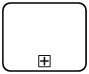 Collapsed Sub Process

#### 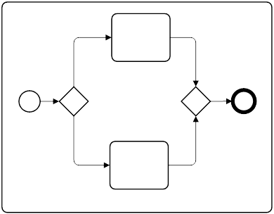 Expanded Sub Process

### Adhoc Sub Process

#### 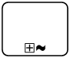 Adhoc Collapsed Sub Process

#### 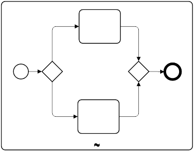Adhoc Expanded Sub Process

### Transaction

#### 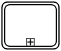 Collapsed Transaction

#### 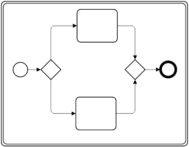 Expanded Transaction

### Event Sub Process

#### 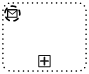 Non-interrupting - Message - Event Sub-Process - Collapsed

####  Interrupting - Message - Event Sub-Process - Collapsed

#### 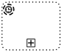 Non-interrupting - Timer - Event Sub-Process - Collapsed

####  Interrupting - Timer - Event Sub-Process - Collapsed

####  Non-interrupting - Conditional - Event Sub-Process - Collapsed

####  Interrupting - Conditional - Event Sub-Process - Collapsed

####  Non-interrupting- Signal - Event Sub-Process - Collapsed

####  Interrupting - Signal - Event Sub-Process - Collapsed

#### 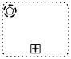 Non-interrupting - Multiple - Event Sub-Process - Collapsed

#### 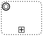 Interrupting - Multiple - Event Sub-Process - Collapsed

####  Non-interrupting - Parallel Multiple - Event Sub-Process - Collapsed

####  Interrupting - Parallel Multiple - Event Sub-Process - Collapsed

#### 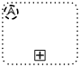 Non-interrupting - Escalation - Event Sub-Process - Collapsed

#### 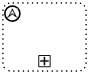 Interrupting - Escalation - Event Sub-Process - Collapsed

#### 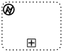 Interrupting - Error - Event Sub-Process - Collapsed

####  Interrupting - Compensation - Event Sub-Process - Collapsed

### Call Activity

####  Abstract Call Activity

#### 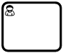 User Call Activity

#### 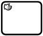 Manual Call Activity

#### 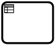 Business Rule Call Activity

#### 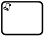 Script Call Activity

## Gateway

###  Exclusive Gateway - without Marker

###  Exclusive Gateway - with Marker

###  Inclusive Gateway

###  Parallel Gateway

###  Complex Gateway

###  Event-Based Gateway

###  Event-Based Gateway to Start a Process

###  Parallel Event-Based Gateway to Start a Process

## Flow

 Sequence Flow

 Message Flow

 Association

 Data Association

### Sequence Flow

####  Sequence Flow

####  Conditional Sequence Flow

####  Default Sequence Flow

### Message Flow

####  Message Flow

####  Initiating Message Flow with Decorator

####  Non-Initiating Message Flow with Decorator

### Data Association

 Data Association

### Association

####  Association

####  Directional Association

####  Bi-Directional Association

## Data

###  Data Object

###  Data Object Collection

###  Data Input

###  Data Input Collection

###  Data Output

###  Data Output Collection

###  Data Store

## Artifact 

###  Group

###  Text Annotation